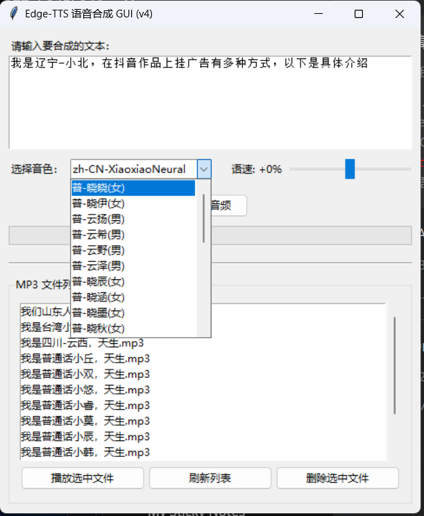

# Edge-TTS 语音合成 GUI



这是一个简洁而强大的桌面应用程序，使用微软 Edge 的在线文本转语音（TTS）服务，提供了一个用户友好的图形界面，可轻松将文字合成为 `.mp3` 音频和 `.srt` 字幕文件。

## 核心功能

- **文本转语音**：输入任意文本，一键生成高质量的音频。
- **丰富的中文音色库**：集成了包括普通话、多种方言（辽宁、陕西、四川等）、粤语、吴语、台湾普通话在内的全量中文音色。
- **可调节的语速**：支持在 -100% 到 +100% 范围内自由调整语速。
- **字幕生成**：在生成音频的同时，自动创建 `.srt` 格式的字幕文件。
- **内置文件管理**：
    - 实时列出所有生成的 `.mp3` 文件。
    - 支持选中文件进行播放。
    - 支持选中文件进行删除（会同时删除关联的字幕文件）。

## 如何运行

1.  **安装依赖**:
    ```bash
    pip install edge-tts
    ```

2.  **运行程序**:
    ```bash
    python ts/demo.py
    ```
